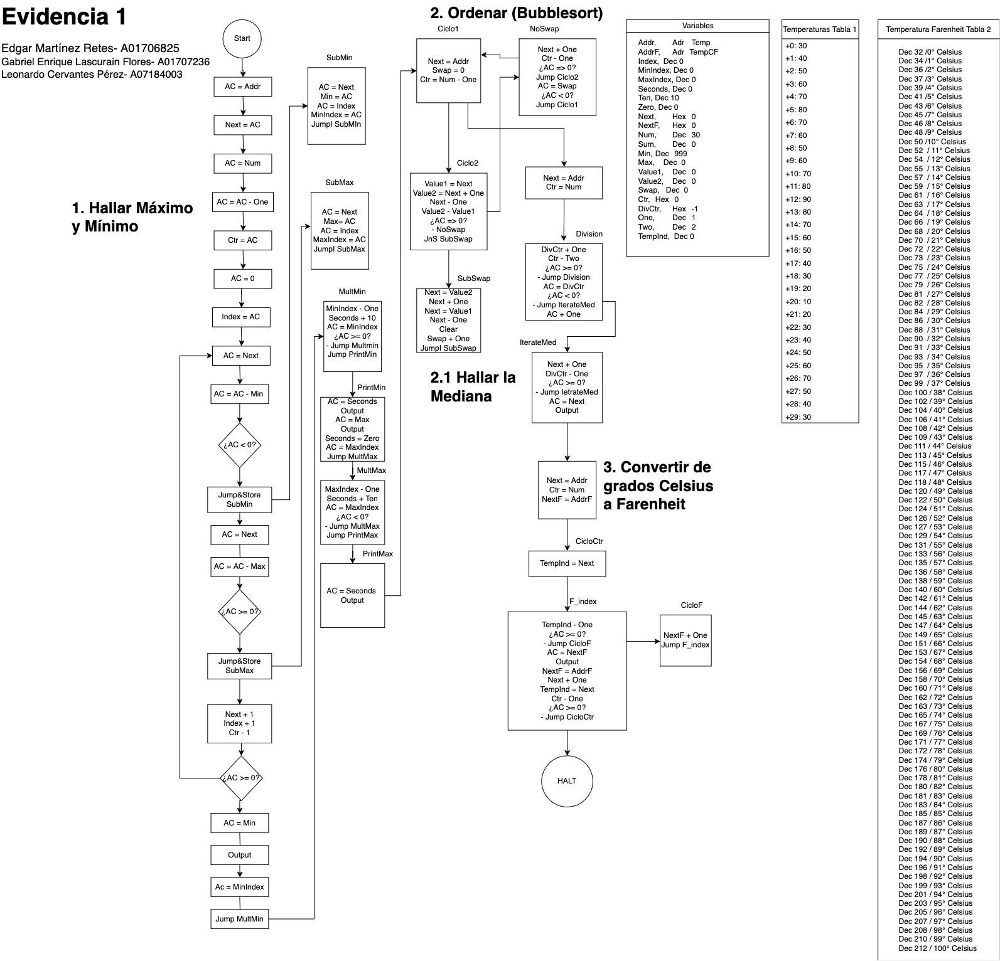

# Sistema de Procesamiento de Datos de Sensores Vehiculares

## Descripción General del Proyecto

Este proyecto implementa un sistema integral de procesamiento de datos de temperatura utilizando el simulador MARIE (Machine Architecture that is Really Intuitive and Easy). El sistema analiza 30 lecturas de temperatura de un sensor vehicular, recolectadas a intervalos de 10 segundos, realizando análisis estadístico y conversiones de unidades completamente en lenguaje ensamblador.

**Características principales:**
- Identificación de valores mínimos y máximos de temperatura con marcas de tiempo
- Cálculo de la mediana usando algoritmos de ordenamiento personalizados
- Conversión de temperatura de Celsius a Fahrenheit
- Simulación de procesamiento de datos en tiempo real para aplicaciones ECU automotrices

## Implementación Técnica

Los siguientes algoritmos fueron implementados en lenguaje ensamblador MARIE, siguiendo el flujo lógico representado en el diagrama del sistema:

### Algoritmos Principales Implementados

**1. Detección de Mínimo/Máximo con Seguimiento de Índices**
- Algoritmo de escaneo lineal para identificar valores extremos
- Seguimiento concurrente de índices para determinar marcas de tiempo (convertidas a segundos)
- Recorrido de arreglos basado en punteros eficiente en memoria

**2. Implementación de Bubble Sort**
- Algoritmo bubble sort personalizado para el cálculo de la mediana
- Banderas de detección de intercambio para optimizar el rendimiento
- Ordenamiento en el lugar con mínimo uso de memoria

**3. Cálculo de la Mediana**
- División matemática por resta repetida
- Maneja conjuntos de datos de tamaño par e impar
- Acceso a arreglos basado en índices para análisis estadístico

**4. Sistema de Conversión de Temperatura**
- Enfoque de tabla de búsqueda para la conversión de Celsius a Fahrenheit
- Valores de conversión precomputados para temperaturas de 0-100°C
- Mapeo basado en índices para conversión eficiente

### Conceptos de Programación Demostrados

**Gestión de Memoria de Bajo Nivel**
- Direccionamiento directo de memoria y manipulación de punteros
- Uso eficiente de arquitectura basada en acumulador
- Colocación estratégica de variables y asignación de memoria

**Diseño de Flujo de Control**
- Estructuras de bucles anidados con múltiples condiciones de salida
- Diseño de subrutinas con manejo adecuado de direcciones de retorno
- Ramificación condicional para optimización de algoritmos

**Implementación de Estructuras de Datos**
- Procesamiento de arreglos con indexación dinámica
- Gestión de estado basada en banderas para algoritmos de ordenamiento
- Diseño de tablas de búsqueda para conversiones matemáticas

**Operaciones de Entrada/Salida**
- Formateo sistemático de la presentación de datos
- Generación secuencial de salidas para la presentación de resultados

## Arquitectura del Proyecto

El sistema procesa un conjunto de 30 lecturas de temperatura a través de cuatro etapas principales, como se ilustra en el siguiente diagrama de flujo:

*Diagrama de flujo completo del sistema que muestra la lógica algorítmica y el proceso de toma de decisiones a lo largo de la canalización de procesamiento de datos del sensor de temperatura.*

La implementación sigue este enfoque estructurado:

1. **Análisis Estadístico**: Identifica valores mínimos/máximos y sus tiempos de ocurrencia
2. **Ordenamiento de Datos**: Implementa bubble sort para preparar la mediana  
3. **Cálculo de la Mediana**: Determina el valor central del conjunto ordenado
4. **Conversión de Unidades**: Convierte todas las temperaturas de Celsius a Fahrenheit

Cada etapa se construye sobre la anterior, creando una canalización de procesamiento de datos cohesiva que refleja la complejidad de las operaciones reales de una ECU automotriz.

## Resultados de Aprendizaje y Competencias

### SICT0202: Análisis de Interacción de Variables
Este proyecto demuestra mi capacidad para interpretar interacciones entre múltiples variables de datos utilizando principios computacionales:

- **Análisis Multivariable**: Seguimiento simultáneo de valores de temperatura, índices y marcas de tiempo
- **Relaciones Estadísticas**: Comprensión de la relación entre la posición de los datos y su significado estadístico
- **Correlación de Datos**: Conexión de lecturas de temperatura con su contexto temporal

### SICT0102: Demostración de Sistemas Computacionales
El proyecto muestra la funcionalidad de sistemas computacionales mediante evidencia empírica:

- **Verificación de Algoritmos**: Cada etapa de procesamiento produce salidas verificables
- **Análisis de Rendimiento**: La implementación de bubble sort demuestra conceptos de complejidad algorítmica
- **Integración de Sistemas**: Múltiples subsistemas trabajan juntos para producir un análisis integral

## Reflexión Final

El mayor desafío fue traducir conceptos algorítmicos de alto nivel al conjunto de instrucciones primitivas de MARIE. Implementar bubble sort requirió una gestión creativa de banderas y un seguimiento meticuloso de la memoria, restricciones que cambiaron fundamentalmente mi enfoque para descomponer problemas.

Este proyecto unió la ciencia de la computación teórica con la realidad de la ingeniería automotriz. Trabajar a nivel de máquina reveló cómo las operaciones de la ECU, que parecen instantáneas, en realidad requieren una cuidadosa orquestación de pasos computacionales básicos. La experiencia resaltó que las capas modernas de abstracción de software, aunque convenientes, pueden ocultar las habilidades de optimización de recursos esenciales para sistemas embebidos.

La disciplina de la programación en ensamblador ha agudizado permanentemente mi enfoque hacia la eficiencia del software, preparándome para desafíos en sistemas embebidos y procesamiento en tiempo real donde cada instrucción cuenta.
