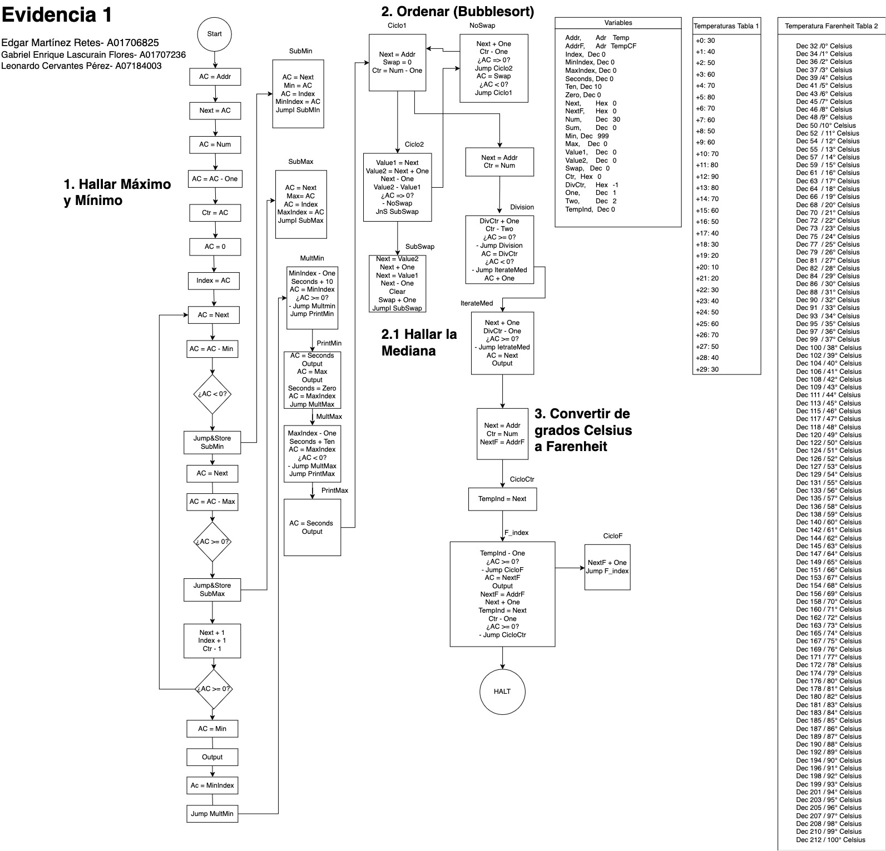

> 📖 🇪🇸 También disponible en español: [README.es.md](README.es.md)

# Vehicular Sensor Data Processing System

## Project Overview

This project implements a comprehensive temperature data processing system using the MARIE (Machine Architecture that is Really Intuitive and Easy) simulator. The system analyzes 30 temperature readings from a vehicular sensor, collected at 10-second intervals, performing statistical analysis and unit conversions entirely in assembly language.

**Key Features:**
- Identification of minimum and maximum temperature values with timestamps
- Median calculation using custom sorting algorithms
- Temperature conversion from Celsius to Fahrenheit
- Real-time data processing simulation for automotive ECU applications

## Technical Implementation

The following algorithms were implemented in MARIE assembly language, following the logical flow depicted in the system diagram:

### Core Algorithms Implemented

**1. Min/Max Detection with Index Tracking**
- Linear scan algorithm to identify extreme values
- Concurrent index tracking to determine timestamps (converted to seconds)
- Memory-efficient pointer-based array traversal

**2. Bubble Sort Implementation**
- Custom bubble sort algorithm for median calculation
- Swap detection flags to optimize performance
- In-place sorting with minimal memory overhead

**3. Median Calculation**
- Mathematical division by repeated subtraction
- Handles both even and odd dataset sizes
- Index-based array access for statistical analysis

**4. Temperature Conversion System**
- Lookup table approach for Celsius to Fahrenheit conversion
- Pre-computed conversion values for temperatures 0-100°C
- Index-based mapping for efficient conversion

### Programming Concepts Demonstrated

**Low-Level Memory Management**
- Direct memory addressing and pointer manipulation
- Efficient use of accumulator-based architecture
- Strategic variable placement and memory allocation

**Control Flow Design**
- Nested loop structures with multiple exit conditions
- Subroutine design with proper return address handling
- Conditional branching for algorithm optimization

**Data Structure Implementation**
- Array processing with dynamic indexing
- Flag-based state management for sorting algorithms
- Lookup table design for mathematical conversions

**Input/Output Operations**
- Systematic data display formatting
- Sequential output generation for results presentation

## Project Architecture

The system processes a dataset of 30 temperature readings through four main processing stages, as illustrated in the comprehensive flow diagram below:

*Complete system flow diagram showing the algorithmic logic and decision-making process throughout the temperature sensor data processing pipeline.*

The implementation follows this structured approach:

1. **Statistical Analysis**: Identifies minimum/maximum values and their occurrence times
2. **Data Sorting**: Implements bubble sort for median preparation  
3. **Median Calculation**: Determines the middle value of the sorted dataset
4. **Unit Conversion**: Converts all temperatures from Celsius to Fahrenheit

Each stage builds upon the previous one, creating a cohesive data processing pipeline that mirrors the complexity of real automotive ECU operations.

## Learning Outcomes & Competencies

### SICT0202: Variable Interaction Analysis
This project demonstrates my ability to interpret interactions between multiple data variables using computational principles:

- **Multi-variable Analysis**: Simultaneous tracking of temperature values, indices, and timestamps
- **Statistical Relationships**: Understanding the relationship between data position and statistical significance
- **Data Correlation**: Connecting temperature readings with their temporal context

### SICT0102: Computational Systems Demonstration
The project showcases computational system functionality through empirical evidence:

- **Algorithm Verification**: Each processing stage produces verifiable outputs
- **Performance Analysis**: Bubble sort implementation demonstrates algorithmic complexity concepts
- **System Integration**: Multiple subsystems work together to produce comprehensive analysis

## Final Reflection

The most significant challenge was translating high-level algorithmic concepts into MARIE's primitive instruction set. Implementing bubble sort required creative flag management and meticulous memory tracking—constraints that fundamentally changed how I approach problem decomposition.

This project bridged theoretical computer science with automotive engineering reality. Working at the machine level revealed how ECU operations that seem instantaneous actually require careful orchestration of basic computational steps. The experience highlighted that modern software abstraction layers, while convenient, can obscure the resource optimization skills essential for embedded systems.

The discipline of assembly programming has permanently sharpened my approach to software efficiency, preparing me for embedded systems and real-time processing challenges where every instruction matters.